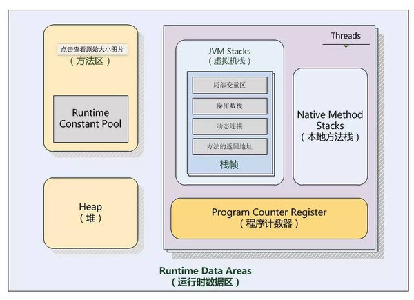
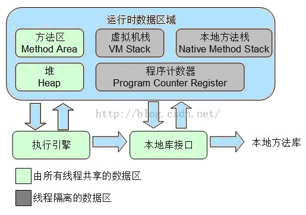

# Java 内存管理及内存区域详解
http://www.cnblogs.com/xingzc/p/5756119.html
https://blog.csdn.net/songhaifengshuaige/article/details/54177612  

总内存大小=堆内存区 + 持久代（永久代、方法区）区大小+程序计数器+Java虚拟机栈+本地方法栈；

  

http://www.codeceo.com/article/java-memory-area.html
https://www.cnblogs.com/yydcdut/p/3959711.html

  

## 直接内存
NIO（New Input/Output）类
java中使用堆外内存，关于内存回收需要注意的事和没有解决的遗留问题

## 程序计数器
是当前线程所执行的字节码的行号指示器。
此内存区域是唯一一个在Java虚拟机规范中没有规定任何OutOfMemoryError情况的区域。

## Java虚拟机栈
虚拟机栈描述的是Java方法执行的内存模型：每个方法在执行的同时都会创建一个栈帧（Stack Frame）用于存储局部变量表、操作数栈、动态链接、方法出口等信息。

如果线程请求的栈深度大于虚拟机所允许的深度，将抛出StackOverflowError异常；如果扩展时无法申请到足够的内存，就会抛出OutOfMemoryError异常。
栈主要存放基本数据类型(byte、short、int、long、float、double、boolean、char)和对象句柄；

## 本地方法栈 
本地方法栈则为虚拟机使用到的Native方法服务。

## Java堆 
此内存区域的唯一目的就是存放对象实例，几乎所有的对象实例都在这里分配内存。
如果在堆中没有内存完成实例分配，并且堆也无法再扩展时，将会抛出OutOfMemoryError异常。
Java Heap是垃圾收集器管理的主要区域，因此很多时候也被称为“GC堆”
堆：存放类类型，用new建立，垃圾自动回收机制负责回收，速度慢
堆是一个“运行时”数据区，类实例化对象是从堆上去分配空间的，也就是说堆上空间都是通过new指令建立

## 方法区 
用于存储已被虚拟机加载的类信息、常量、静态变量、即时编译器编译后的代码等数据。
HotSpot虚拟机上开发、部署程序的开发者来说，很多人都更愿意把方法区称为“永久代”（Permanent Generation）
运行时常量池（Runtime Constant Pool）是方法区的一部分。当常量池无法再申请到内存时会抛出OutOfMemoryError异常。
当方法区无法满足内存分配需求时，将抛出OutOfMemoryError异常。

### Java方法区
http://www.cnblogs.com/wangguoning/p/6109377.html  
对每个加载的类型，jvm必须在方法区中存储以下类型信息： 

1. 这个类型的完整有效名 
2. 这个类型直接父类的完整有效名(除非这个类型是interface或是 java.lang.Object，两种情况下都没有父类) 
3. 这个类型的修饰符(public,abstract, final的某个子集) 
4. 这个类型直接接口的一个有序列表 
为了提高访问效率，必须仔细的设计存储在方法区中的数据信息结构。除了以上讨论的结构，jvm的实现者还可以添加一些其他的数据结构，如方法表。
jvm对每个加载的非虚拟类的类型信息中都添加了一个方法表，方法表是一组对类实例方法的直接引用(包括从父类继承的方法)。

## java：方法的虚分派(virtual dispatch)和方法表（method table）
http://blog.csdn.net/bluetjs/article/details/52608833  
父类的方法比子类的方法先得到解析，即父类的方法相比子类的方法位于表的前列。
表中每项对应于一个方法，索引到实际方法的实现代码上。如果子类重写了父类中某个方法的代码，则该方法第一次出现的位置的索引更换到子类的实现代码上，而不会在方法表中出现新的项。
